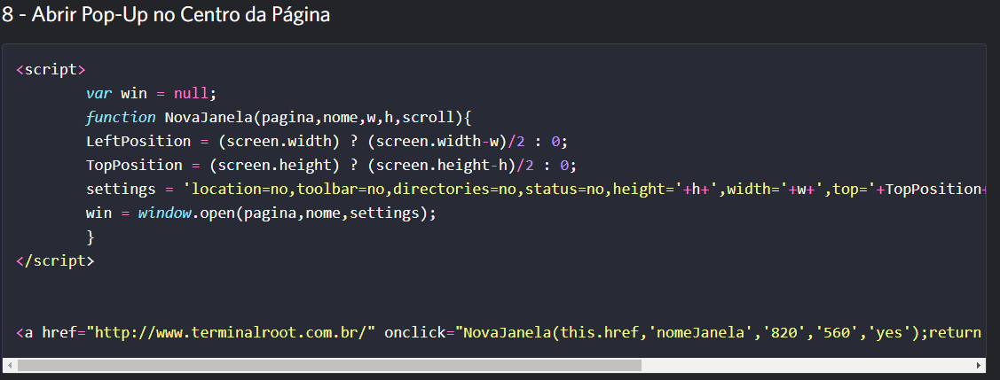
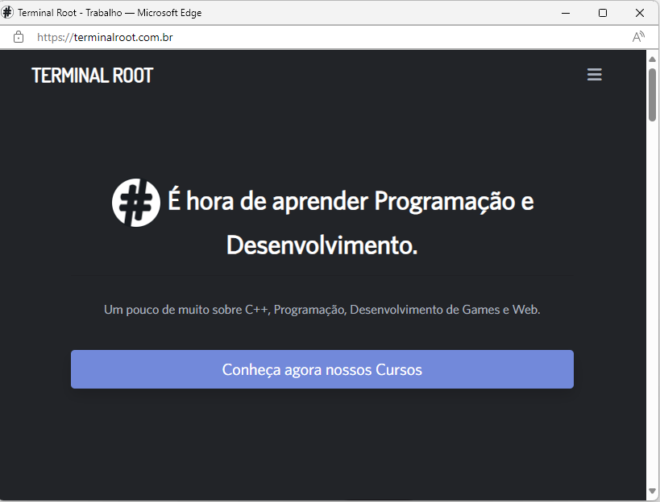
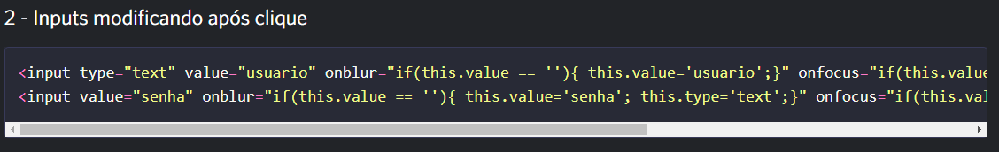
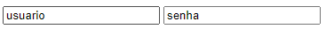

<h1 align="center"> Analise_Codigo_JS </h1> 

🚧 Projeto em construção 🚧

Primeiros tivemos que escolher 2 codígos e pegar e colocar no Vscode e entender o significado e oque esscos codígos apresenta e qusal a ultilidade.

# 📁 Primeiro codígo

O codígo que eu escolhi foi o número 8:

Nesse codígo foi possivel entender que ele significa das palavra usada como:  
* ``screen.width`` é para dar a lagura de tela em pixel
* ``LeftPosition`` e para posicionar as palavras escritas na esquerda
* ``TopPosition`` é usada para deixar na posição superior
* ``screen.height`` é para dar altura na tela 

Com isso usando quando vc clina na palavra escrita acaba abrindo nessa pagína:

Então demos a entender que esse codígo e uma palavra sendo um botão e quando é clicado acaba abrindo outra pagina para uma incrição de curço para a pessoa se escrever e logar no seu E_mail.

# 📁 segundo codígo

O outro codígo escolido foi o número 2:

nesse codígo é mais diferente que o outro é usado para você usar como vc fosse entra numa conta ele fica assim:

